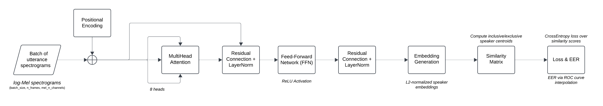
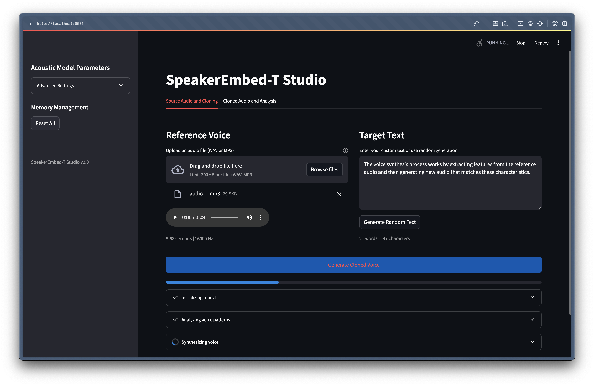

<!-- ============================ HEADER ============================ -->
<h1 align="center">SpeakEmbed-T : Transformer Based Speaker Encoder for Voice Cloning & Speaker Diarisation Suite</h1>

<p align="center">
  <em>A research toolkit for extracting speaker identity from audio using a custom-trained Transformer encoder for voice cloning and speaker diarisation.</em>
</p>

<!-- Badges. Generate at https://shields.io/. -->
<p align="center">
  <a href="https://github.com/Keegz-dz/SpeakEmbed-T/commits/main">
    
  </a>
  <a href="./LICENSE">
    
  </a>
  <a href="https://pytorch.org/">
    
  </a>
  <a href="https://www.python.org/downloads/release/python-3100/">
    
  </a>
  <a href="#">
    
  </a>
</p>

<!-- Animated demo GIF which conveys the project's value instantly. -->
<p align="center">
  
</p>

<!-- ============================ TL;DR ============================ -->
## Overview
SpeakEmbed-T is a custom-trained Transformer-based speaker encoder that extracts compact speaker representations from short audio samples. The model converts speech into discriminative embedding vectors that capture speaker identity, enabling downstream tasks such as voice cloning and speaker diarisation. The project focuses on the speaker encoder itself as the primary research component, with downstream applications included to demonstrate the quality of the learned embedding space. 

Unlike conventional approaches built around recurrent architectures, SpeakEmbed-T replaces the standard LSTM encoder with a Transformer architecture trained using the GE2E loss objective, improving speaker discrimination while maintaining real-time inference capability. A combination of Transformer-based sequence modelling, GE2E optimisation, and phase-aware preprocessing enables the system to generalise more effectively to unseen speakers and noisy acoustic conditions than the LSTM-based baselines it replaces.

<p align="left">
  <a href="https://www.notion.so/Speech-to-Text-Synthesis-1be9a13cb0ab80b9ad17eea6fbd072c1?source=copy_link">
    
  </a>
</p>


<!-- ============================ TOC ============================ -->
## Table of Contents

1. [Key Results](#key-results)
2. [Demo](#demo)
3. [Architecture](#architecture)
4. [Installation](#installation)
5. [Project Structure](#project-structure)
6. [Training and Evaluation](#training-and-evaluation)
7. [Limitations](#limitations)
8. [Citation](#citation)
9. [Acknowledgements](#acknowledgements)
10. [Licence](#licence)
11. [Contact](#contact)

<!-- ============================ RESULTS ============================ -->
## Key Results

A controlled comparison against the LSTM baseline is deferred until both models are trained to equivalent convergence stages. See [Limitations](#limitations).

### Encoder Training

The speaker encoder was trained on the LibriSpeech `train-clean-100` subset using the GE2E loss objective. Training was halted at step **73,500** due to compute limitations, the released checkpoint corresponds to the lowest-loss weights obtained during training.

<div align="center">

| Training Step | GE2E Loss | Batch EER |
|:--|:--:|:--:|
| 31,000 | 0.292 | 3.00% |
| 50,000 | 0.199 | 1.95% |
| 66,000 | 0.078 | 0.83% |
| **73,500** | **0.072** | **~0.90%** |

</div>

<p align="center">
  <sub>
    Lower GE2E loss and Equal Error Rate (EER) indicate improved speaker discrimination performance.
  </sub>
</p>

The final checkpoint demonstrates stable convergence and strong speaker-separation capability despite the reduced training duration.


### Synthesis Quality

The voice cloning pipeline was evaluated on 20 generated samples using custom acoustic quality metrics. Scores are reported on a **0–100** scale and assess characteristics of the synthesised audio independently of any reference recording.

<div align="center">

| Metric | Score | Description |
|:--|:--:|:--|
| **Articulation** | **80.4** | Clarity of phoneme transitions and consonant definition |
| **Speech Rhythm** | **79.3** | Natural pacing and pause distribution |
| Timbre Richness | 44.0 | Spectral richness and harmonic structure |
| Pitch Stability | 43.1 | Consistency of pitch contours over time |

</div>

Articulation and rhythm scores indicate that the pipeline produces intelligible and naturally paced speech. Timbre and pitch metrics primarily reflect the characteristics of the current synthesiser and vocoder stack rather than limitations of the speaker encoder itself.

<!-- ============================ DEMO ============================ -->
## Demo

https://github.com/user-attachments/assets/58df0ba0-a2d8-4937-bb92-aa9e14fe0225
<p align="center">
  <sub>
    Voice Cloning Demo.
  </sub>
</p>
<br>

https://github.com/user-attachments/assets/b9d764d2-b19a-405b-8541-e5d6aacaa1b7
<p align="center">
  <sub>
    Speaker Diarisation Demo.
  </sub>
</p>

<!-- ============================ ARCHITECTURE ============================ -->
## Architecture

SpeakEmbed-T is structured as a three-stage voice synthesis pipeline. A speaker encoder first extracts a speaker embedding from reference audio, a Tacotron 2 synthesizer generates a mel-spectrogram conditioned on that embedding, and a WaveRNN vocoder converts the spectrogram into a time-domain waveform.

<p align="center">
  
</p>


### 1. Speaker Encoder

The encoder is the primary research component of this project. It maps variable-length audio to
a fixed 256-dimensional L2-normalised speaker embedding representing speaker identity.

#### 1.1 Audio Preprocessing
Raw audio passes through three sequential stages before any neural processing:

**1. Resampling & Mono conversion** — Audio is resampled to 16 kHz and downmixed to a
single channel, standardising input regardless of recording conditions.

**2. Volume normalisation** — The waveform is normalised to −30 dBFS. RMS power is
computed across the signal, converted to dBFS, and a gain factor is applied:

$$
\text{Gain Factor} = 10^{\frac{\text{dBFS Change}}{20}}
$$

<p align="center">
  <sub>
    This ensures consistent amplitude without clipping and reduces sensitivity to recording level variation across speakers.
  </sub>
</p>


**3. Voice Activity Detection (VAD)** — Non-speech frames are removed before feature
extraction. The signal is divided into fixed 30 ms windows (480 samples at 16 kHz),
each classified as speech or silence by a WebRTC VAD module. A moving-average
smoothing kernel of width 8 is applied across the binary flags to suppress short
false positives and fill brief gaps, then the retained speech windows are
concatenated.

$$
\text{smoothed flags}[i] =
\frac{1}{W}
\sum_{j=i-\frac{W}{2}}^{i+\frac{W}{2}}
\text{voice flags}[j]
$$

```bash
┌────────────┬────────────┬────────────┬────────────┬──────┐
│  Window 1  │  Window 2  │  Window 3  │  Window 4  │ Left │
├────────────┼────────────┼────────────┼────────────┼──────┤
│  400 samp  │  400 samp  │  400 samp  │  400 samp  │  50  │
└────────────┴────────────┴────────────┴────────────┴──────┘

┌────────────┬────────────┬────────────┬────────────┐
│  Window 1  │  Window 2  │  Window 3  │  Window 4  │
├────────────┼────────────┼────────────┼────────────┤
│  400 samp  │  400 samp  │  400 samp  │  400 samp  │
└────────────┴────────────┴────────────┴────────────┘
```


#### 1.2 Feature Extraction

The preprocessed waveform is converted into a log-mel spectrogram using:

- **40 mel-frequency bins**
- **25 ms analysis windows**
- **10 ms frame shift**

The resulting spectrogram forms the direct input to the Transformer encoder.

#### 1.3 Encoder Architecture

<div align="center">

| Component | Configuration |
|:--|:--|
| Positional Encoding | Learnable scalar vector · shape `(1, 1, 40)` |
| Transformer Encoder | 3 layers · 8 attention heads · `d_model = 40` |
| Layer Normalisation | Applied after the transformer stack |
| Temporal Pooling | Mean pooling across the time dimension |
| Projection Head | Linear `40 → 256` + ReLU |
| Output Representation | L2-normalised 256-dimensional speaker embedding |

</div>
<br>



<p align="center">
  <sub>Transformer-based speaker encoder architecture used in SpeakEmbed-T.</sub>
</p>

#### 1.4 Inference (Partial Utterance Averaging)

At inference, long audio is not processed in one pass. The waveform is segmented into
overlapping windows (50% overlap, 800 ms each). The encoder processes each segment
independently, and the resulting embeddings are averaged then L2-normalised to produce
the final utterance embedding. This makes the encoder robust to variable audio lengths
and reduces sensitivity to individual segment quality.

#### 1.5 Training Objective — GE2E Loss

The encoder is trained with Generalised End-to-End (GE2E) loss. Each batch contains
40 speakers × 10 utterances. For each speaker, two types of centroid are computed:

- **Inclusive centroid** — mean of all utterances for a speaker
- **Exclusive centroid** — mean of all utterances *except* the one being evaluated

A cosine similarity matrix is constructed between every utterance embedding and every
speaker centroid. Cross-entropy loss is applied so each utterance scores highest
against its own speaker's centroid. Similarity scores are scaled and shifted by two
learnable parameters initialised at `w = 10`, `b = −5`. EER is computed each step
as a diagnostic but is not backpropagated.

### 2. Synthesizer

A pretrained Tacotron 2 model that generates mel-spectrograms (80 mel bins, 12.5 ms
frame shift) from normalised text. The 256-d speaker embedding is injected as a
conditioning signal at every decoder step, transferring voice identity to the
output spectrogram.

### 3. Vocoder

A pretrained WaveRNN vocoder that converts mel-spectrograms to 16 kHz waveforms
using RAW sample prediction with 9-bit mu-law quantisation. Upsampling is performed
in three stages with factors (5, 5, 8), matching the synthesizer's 200-sample hop.

<!-- ============================ INSTALLATION ============================ -->
## Installation

### Prerequisites

- Python 3.10
- 8 GB RAM (16 GB recommended for training)
- At least 5 GB of free disk space (for model weights and processed data)
- An NVIDIA GPU with CUDA is optional but recommended for training; CPU is sufficient for inference

### Quick start

Run the application locally with a conda environment:    

1. Create and activate a virtual environment:
    ```bash
    python -m venv .venv
    source .venv/bin/activate
    ```
2. Install the required dependencies:
    ```bash
    conda env create -f environment.yml
    conda activate speakembed-T
    ```
3. Launch the Streamlit application:
    ```bash
    streamlit run streamlit_app.py
    ```
4. Open your browser and navigate to [http://localhost:8501](http://localhost:8501).

   

<!-- ============================ STRUCTURE ============================ -->
## Project Structure

```
SpeakEmbed-T/
│
├── app.py                        # voice cloning studio UI
├── environment.yml               
├── requirements.txt              
│
├── scripts/                     
│   ├── main.py                       # Orchestrates encoder → synthesizer → vocoder pipeline
│   ├── speech_encoder_v2_updated.py  # Transformer speaker encoder 
│   ├── speech_encoder.py             # LSTM baseline encoder 
│   ├── embed.py                      # Partial-utterance embedding 
│   ├── synthesizer.py                # Tacotron 2 wrapper
│   ├── vocoder.py                    # WaveRNN wrapper
│   └── params.py                     # All hyperparameters for audio, model, and training
│
├── data_preprocessing/           # Audio preprocessing pipeline 
├── data_scripts/                 # Dataset loading utilities and voice quality metrics
├── utils/                        # Tacotron text processing
├── visualisations/               # Speaker diarisation scripts
│
├── evaluations/                  # Objective evaluation scripts (synthesis quality, speaker similarity)
├── demo/                         # Exploratory and demonstration notebooks
│
├── models/                                  # Pretrained model weights (not in version control)
│   ├── speech_encoder_transformer_updated/  # Transformer encoder checkpoint (step 73,500)
│   ├── speech_encoder_lstm/                 # LSTM baseline checkpoint
│   ├── synthesizer/                         # Tacotron 2 weights
│   └── vocoder/                             # WaveRNN weights
│
├── data/                         # Processed mel-spectrogram frames (not in version control)
├── datasets/                     # Raw audio data (not in version control)
├── assets/                       # Images used in README
├── test/                         # Sample audio files for manual testing
└── temp/                         # Audio processing and visualisation helpers by Corentin Jemine imported in active pipeline 
```

<!-- ============================ TRAINING ============================ -->
## Training and Evaluation

### Data preparation

Download LibriSpeech `train-clean-100` and place it at
`datasets/LibriSpeech/train-clean-100/`, then run the preprocessing pipeline:

```bash
python data_preprocessing/data_preprocessing.py
```

This walks every speaker directory, loads each `.flac` file, applies resampling,
volume normalisation, and VAD, converts the result to a log-mel spectrogram, and
saves it as a `.npy` file under `data/processed_data/`. Utterances shorter than
160 frames (~1.6 seconds after silence removal) are discarded. A `_sources.txt`
index is written per speaker mapping each `.npy` back to its source file.

Expected output:
```
Processing speakers: 100%|████████████| 251/251 [xx:xx<00:00]
Preprocessing complete.
Total processed files: XXXXX
```

### Training the Encoder

Open and run `demo/training_encoder_v2.ipynb`. The notebook trains
`SpeechEncoderV2` from `data/processed_data/` and saves a checkpoint every
500 steps to `models/speech_encoder_transformer_updated/`.

<div align="center">

| Parameter | Value | Description |
|:--|:--:|:--|
| `speakers_per_batch` | 40 | Number of speakers sampled per training batch |
| `utterances_per_speaker` | 10 | Number of utterances sampled per speaker |
| `save_every` | 500 | Interval between checkpoint saves |
| `backup_every` | 5000 | Interval between full model backups |
| `learning_rate` | 1e-4 | Initial optimiser learning rate |

</div>

<p align="center">
  <sub>
    Key configuration values.
  </sub>
</p>
<br>

Expected output per checkpoint:
```
Training: | 42234/250000000 [8:39:33, 1.23step/s, eer=0.00904, loss=0.0724]
Saving the model (step 73500) to models/speech_encoder_transformer_updated/encoder_073500_loss_0.0724.pt
```

To resume from an existing checkpoint, set `force_restart = False` and point
`init_step` to the step number of the checkpoint you want to continue from.


### Evaluation

Two evaluation scripts are provided. Run both from the project root after
cloned audio has been generated (either via the UI or `evaluations/clone_dataset_eval.py`).

**1. Synthesis quality** — measures articulation, rhythm, timbre, and pitch of cloned outputs:

```bash
python evaluations/voice_quality_batch_eval.py
```

```
Voice Quality Results (20 files)
----------------------------------------
  Timbre Richness      44.0 / 100
  Pitch Stability      43.1 / 100
  Articulation         80.4 / 100
  Speech Rhythm        79.3 / 100

Full report saved to data/evaluations/voice_quality_results.json
```

**2. Speaker similarity** — cosine similarity between reference and cloned speaker embeddings:

```bash
python evaluations/speaker_similarity_eval.py
```

```
Speaker Similarity Results (20 pairs)
----------------------------------------
  Avg cosine similarity:   0.0491
  Min:                     0.0056
  Max:                     0.1250

Full report saved to data/evaluations/speaker_similarity_results.json
```

<!-- ============================ LIMITATIONS ============================ -->
## Limitations

1. **The encoder is undertrained.** The released checkpoint is at step 73,500 against
a target of 200,000+, halted due to compute constraints. The speaker similarity
evaluation (avg cosine similarity: 0.049) is direct evidence of this. The encoder
has not yet converged to embeddings that reliably cluster speaker identity. Articulation
and rhythm scores are reasonable, but voice identity transfer improves significantly
with further training.

2. **The synthesizer and vocoder are not trained by this project.** Tacotron 2 and
WaveRNN weights are inherited from the Real-Time Voice Cloning toolkit. The quality
ceiling of the synthesis pipeline is therefore set by those pretrained models, not
by the encoder. Improvements to the encoder alone cannot fix artefacts introduced
downstream.

3. **The full cloning pipeline is not real-time.** The speaker encoder alone operates
in real time, embedding extraction takes ~120ms on CPU. The bottleneck is the
downstream synthesis: Tacotron 2 and WaveRNN together take approximately 30 seconda
on CPU per inference, making the complete voice cloning pipeline unsuitable for
streaming or interactive applications without hardware acceleration.

<!-- ============================ CITATION ============================ -->
## Citation

If you use this work in your research, please cite:

```bibtex
@software{dsouza2025speakembedt,
  author       = {Dsouza, Keegan},
  title        = {SpeakEmbed-T: Transformer Based Speaker Encoder for Voice Cloning and Speaker Diarisation Suite},
  year         = {2025},
  url          = {https://github.com/Keegz-dz/SpeakEmbed-T},
  version      = {1.0.0}
}
```

<!-- ============================ ACKNOWLEDGEMENTS ============================ -->
## Acknowledgements

This project builds on the following prior work:
- **Jemine, C. (2019).** *Real-Time Voice Cloning.* The synthesis pipeline, pretrained Tacotron 2 and WaveRNN weights, and portions of the audio preprocessing utilities used in this project were adapted from this implementation. [GitHub Repository](https://github.com/CorentinJ/Real-Time-Voice-Cloning)

- **Resemble AI (2019).** *Resemblyzer.* Voice embedding and preprocessing toolkit referenced for the VAD implementation used in the preprocessing pipeline. [GitHub Repository](https://github.com/resemble-ai/Resemblyzer)

- **Wan, L. et al. (2018).** *Generalized End-to-End Loss for Speaker Verification.* IEEE International Conference on Acoustics, Speech and Signal Processing (ICASSP). The GE2E loss objective and batch structure used to train the speaker encoder. [Paper](https://arxiv.org/abs/1710.10467)

- **Jia, Y. et al. (2018).** *Transfer Learning from Speaker Verification to Multispeaker Text-To-Speech Synthesis.* Advances in Neural Information Processing Systems (NeurIPS). The SV2TTS framework that this pipeline is architecturally based on. [Paper](https://arxiv.org/abs/1806.04558)

- **Vaswani, A. et al. (2017).** *Attention Is All You Need.* Advances in Neural Information Processing Systems (NeurIPS). The Transformer architecture used in the speaker encoder. [Paper](https://arxiv.org/abs/1706.03762)

- **Panayotov, V. et al. (2015).** *LibriSpeech: An ASR Corpus Based on Public Domain Audio Books.* IEEE International Conference on Acoustics, Speech and Signal Processing (ICASSP). The dataset used for training and evaluation. [Dataset](https://www.openslr.org/12/)

<!-- ============================ LICENCE ============================ -->
## Licence
 
This project is released under the MIT Licence. See [`LICENSE`](LICENSE) for full text.

<!-- ============================ CONTACT ============================ -->
## Contact

Maintained by [Keegan Dsouza](https://github.com/Keegz-dz). For bug reports and feature requests, please open an issue on the [issue tracker](https://github.com/Keegz-dz/SpeakEmbed-T/issues).

<p align="left">
  <a href="https://www.linkedin.com/in/keegan-dsouza-4019162b9/">
    
  </a>
  <a href="mailto:keegz29.dz@gmail.com">
    
  </a>
</p>
